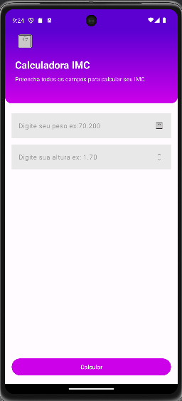
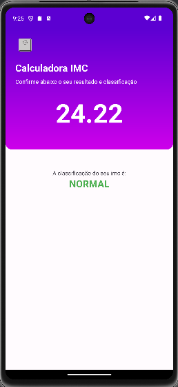
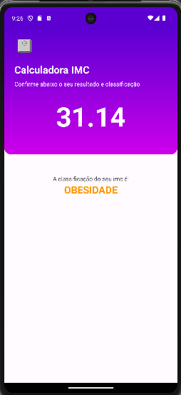

# 🧮 Calculadora de IMC

Aplicativo Android simples e intuitivo para calcular o **Índice de Massa Corporal (IMC)**, desenvolvido em **Kotlin** com **Jetpack Compose**.  
Permite calcular o IMC rapidamente e exibir a classificação de acordo com a OMS (Abaixo do peso, Normal, Sobrepeso, Obesidade).

---

## :camera_flash: Screenshots

| Tela Inicial | Resultado | Obesidade |
|--------------|-----------|-----------|
|  |  |  |

---

## ⚙️ Funcionalidades

- Entrada de peso e altura do usuário  
- Cálculo automático do IMC  
- Exibição da classificação do IMC  
- Interface moderna e responsiva  
- Aprendizado sobre State e recomposição no Jetpack Compose  

---

## 🛠️ Tecnologias Utilizadas

- Kotlin  
- Jetpack Compose  
- XML  
- MVVM (ViewModel + Repository Pattern)  
- Android Studio  
- Git / GitHub  

---

## 🚀 Aprendizados

Durante o desenvolvimento, aprimorei o uso de **State e recomposição no Jetpack Compose**, boas práticas de UI declarativa e lógica de cálculo de forma limpa e organizada.  
Este projeto reforçou meu conhecimento em **arquitetura MVVM** e integração entre **ViewModel e UI**.

---

The MIT License (MIT)

Copyright (c) 2025 Bruna Costa Fenali

Permission is hereby granted, free of charge, to any person obtaining a copy of
this software and associated documentation files (the "Software"), to deal in
the Software without restriction, including without limitation the rights to
use, copy, modify, merge, publish, distribute, sublicense, and/or sell copies
of the Software, and to permit persons to whom the Software is furnished to do
so, subject to the following conditions:

The above copyright notice and this permission notice shall be included in all
copies or substantial portions of the Software.

THE SOFTWARE IS PROVIDED "AS IS", WITHOUT WARRANTY OF ANY KIND, EXPRESS OR
IMPLIED, INCLUDING BUT NOT LIMITED TO THE WARRANTIES OF MERCHANTABILITY,
FITNESS FOR A PARTICULAR PURPOSE AND NONINFRINGEMENT. IN NO EVENT SHALL THE
AUTHORS OR COPYRIGHT HOLDERS BE LIABLE FOR ANY CLAIM, DAMAGES OR OTHER LIABILITY,
WHETHER IN AN ACTION OF CONTRACT, TORT OR OTHERWISE, ARISING FROM, OUT OF OR IN
CONNECTION WITH THE SOFTWARE OR THE USE OR OTHER DEALINGS IN THE SOFTWARE.
